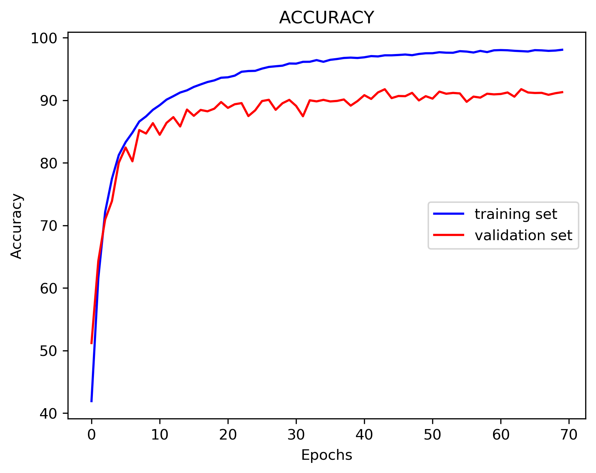
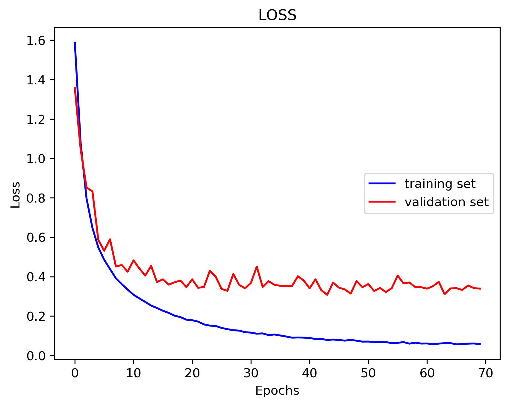
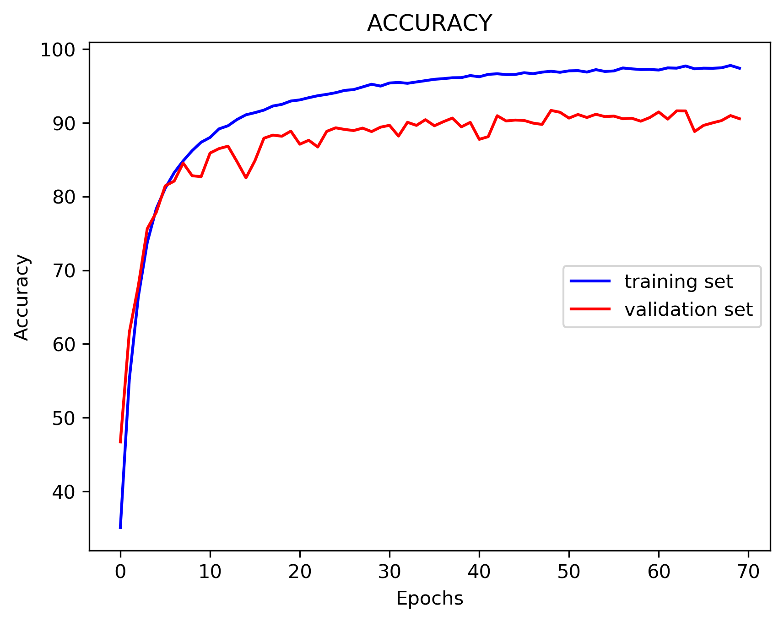
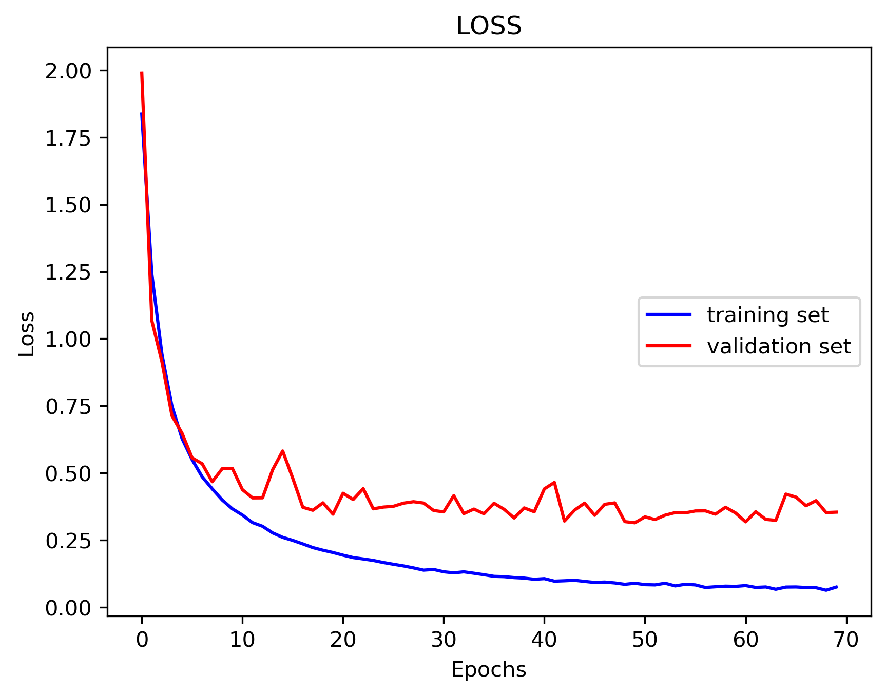

# Resnet Models
## Description 
Pytorch Implementation of ResNet34 and ResNet50 v1.5 on CIFAR-10 dataset. Original paper can be found [here](https://arxiv.org/pdf/1512.03385.pdf).
In original paper model is trained on ImageNet dataset but my implementation is based on CIFAR-10 dataset. Thus input size to my models has shape **32x32x3**.

## Models
ResNet is one of the models which revolutionized deep learning field. It is the first model which deep enough and was able to achieve high accuracy on Image Classification task.
The problem with deep models was that they suffered from gradient vanishing problem, during backpropogation gradients of first layers were close to zero. 
Thus they were not able to learn anything at all. ResNet solves this problem with residual connection between blocks. Blocks are made from several convolutional layers.
There are 2 convolutions in ResNet34 whereas in ResNet50 v1.5 there are 3 convolutions. Take a look at image below.  
<p align="center">
    
</p>    
ResNet composed of 4 main groups of blocks. The difference between ResNet34 and ResNet50 is that first one has 34 layers and later has 50 layers. Moreover 
the number blocks in group is different in each of them. The image below explains architecture of both models. Unlike original paper, we have stride=1 in first convolution 
of a model and don't use pooling after that. Moreover first group of blocks uses only stride=1. First blocks of later groups has stride=2.
This is done because input size of CIFAR-10 is **32x32** which is much smaller than size of ImageNet.
<p align="center">
    
</p>

## Training
```
python3 train.py
```
SGD optmizer was used for training, with *learning_rate=0.01*, *momentum=0.9* and *weight_decay=5e-4*. Training is done for 70 epochs on NVIDIA RTX2070.   
**ResNet34**
<p align="center">
 
</p>        

**ResNet50 v1.5**        
<p align="center">
 
</p>

## Testing
```
python3 test.py
```
Model evaluation metrics are *TOP1 Accuracy* and *TOP5 Accuracy*.    
    
**ResNet34**    
- *TOP1 Accuracy*: 91.25%      
- *TOP5 Accuracy*: 99.80%    
     

**ResNet50 v1.5**    
- *TOP1 Accuracy*: 91.12%     
- *TOP5 Accuracy*: 99.73%    


## Requirements
* PyTorch 1.5.0
* Numpy 1.18.1
* Matplotlib 3.1.1
